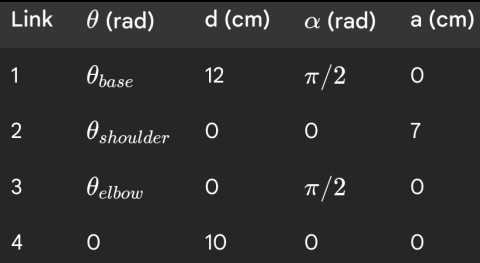

# ROS Manipulator Simulation & Control Task

## Overview

In this assignment, you are provided with the following resources for a 3-DOF robotic manipulator:

- The robot's URDF file (`urdf/robot.urdf`)
- STL mesh files for visualization and collision
- DH parameters for the manipulator (`ros_task/dh_parameters.png`)

- A set of joint angle commands (`ros_task/angles.txt`)
- Example launch files and configuration files

Your task is to **complete the ROS 2 package** so that:

1. The robot is spawned in Ignition Gazebo using its URDF and mesh files.
2. The robot is controlled by publishing joint positions read from `angles.txt`.
3. The code structure is modular and follows ROS 2 best practices.

---

## Provided Files

- **urdf/robot.urdf**: The robot's URDF description, referencing STL meshes.
- **meshes/**: STL files for each robot part.
- **ros_task/DH_parameters.txt**: The DH parameters for the manipulator (for reference).
- **ros_task/angles.txt**: Each line contains a set of joint angles (degrees) and a gripper command.
- **config/manipulator.yaml**: Controller configuration for ros2_control.
- **launch/display.launch.py**: Launches the simulation and robot spawning (incomplete, you must fill in the missing parts).
- **launch/spawn_robot.launch.py**: Launches the robot and controllers (provided for reference).
- **src/fk_task.py**: The Python node for reading angles and publishing commands (skeleton provided, you must implement).
- **CMakeLists.txt**: Build and install instructions (some install rules missing, you must complete).
- **package.xml**: ROS 2 package manifest.

---

## Your Tasks

### 1. `src/fk_task.py`

- The file is provided as a skeleton with comments.
- **You must implement a ROS 2 node** that:
  - Reads joint angles and gripper commands from `angles.txt`.
  - Publishes the corresponding joint positions to the `/forward_position_controller/commands` topic at a fixed interval (e.g., every 2 seconds).
  - Computes and prints the end-effector position using the DH parameters and displays on terminal.
  -(optional) Store the values of final end-effector position in a file.

### 2. `launch/display.launch.py`

- The file is partially complete.
- **You must fill in the missing code** to:
  - Set up the environment for Ignition Gazebo.
  - Launch Ignition Gazebo with an empty world.
  - Include the robot spawn launch file.
  - Ensure the robot is spawned and controllers are started.

### 3. `spawn_robot.launch.py`

- Provided for reference. You do **not** need to modify this file.

---

## Submission Checklist

- [ ] `src/fk_task.py` is implemented and works as described.
- [ ] `launch/display.launch.py` is complete and launches the simulation as described.
- [ ] You have to launch the simulation, and the robot moves according to `angles.txt`.
- [ ] You have recorded a video showing both the terminals and gazebo when the nodes are running.
- [ ] Copy the final end-effector position in a file which we get as a result of running the fk_task.py node.

---
## Installation

To get started, clone this repository into a ROS 2 workspace and build it as follows:

```bash
mkdir -p eklavya_ws/src
cd eklavya_ws/src
git clone https://github.com/NoobMaster-version/ros_task_eklavya
cd ..
colcon build
```

---

## Getting Started

1. Build the package:
    ```
    colcon build
    source install/setup.bash
    ```
2. Launch the simulation:
    ```
    ros2 launch ros_task_eklavya display.launch.py
    ```
3. In a new terminal, run your node:
    ```
    ros2 run ros_task_eklavya fk_task.py
    ```
4. Copy the values of final end-effector position in a file which we get as a result of running the fk_task.py node.

5. Record the video of in which both the terminals and gazebo are seen and upload it to the provided link.

---

**If you are getting any issues with missing dependencies, run:**
```
chmod +x dependencies_installation.sh
./dependencies_installation.sh
```

---

## Dont use GPT , Good luck! :)
